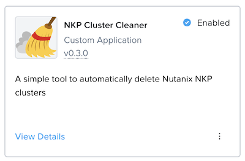

# NKP Catalog Application


The Web UI can be installed as a NKP Catalog Application and makes use of features enabled in the Management Cluster:

- Traefik ingress controller (with optional authentication, enabled by default)
- The default kommander kubeconfig secret for self-attachment. 

Note that this currently does **not** enable the deletion logic, it is purely a read-only view of the deletion rules and cluster states. See https://github.com/markround/nkp-cluster-cleaner/issues/6.

## Installation

To install the custom catalog, run the following command:

```bash
nkp create catalog nkp-cluster-cleaner \
    -w kommander-workspace \
    --branch main \
    --url https://github.com/markround/nkp-cluster-cleaner
```

You can then select the application in the Management Cluster Workspace and enable it. After it has been deployed, the dashboard can be accessed in the usual way, e.g. by browsing to the Management Cluster and selecting the Application Dashboards tab.

## Configuration

Assuming a standard installation of NKP Ultimate, the application will work without any further configuration required. For a full reference of the Helm values, see the included [Chart documentation](/charts/nkp-cluster-cleaner/README.md). Note that the defaults will require an admin account to log-in and view the dashboard. More granular RBAC will be added in a future release - see https://github.com/markround/nkp-cluster-cleaner/issues/4.

### Default rules

The default rules provided exclude the `default` namespace and any cluster with `-prod-` in the name. To change this, set the `app.config` key when deploying the application, e.g.

```yaml
app:
  config: |
    excluded_namespace_patterns:
    - ^default$
    - ^some-other-namespace$ 
    protected_cluster_patterns:
    - .*-prod-.*
    - .*-production-.*
    - ^critical-.*
```

